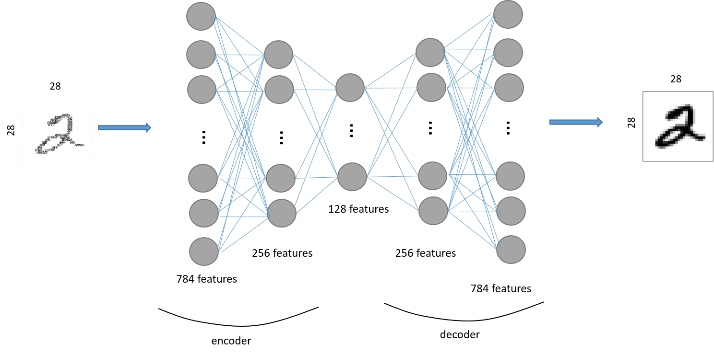

# Denoising Autoencoder
This project implements an autoencoder in Tensorflow and investigates its ability to reconstruct images, from the MNIST dataset, after they are corrupted by artificial noise.



## Setup ##
**Installation:** ```sudo pip install -r requirements.txt``` <br />
**Run:** ```jupyter notebook Denoise_Autoencoder.ipynb```
